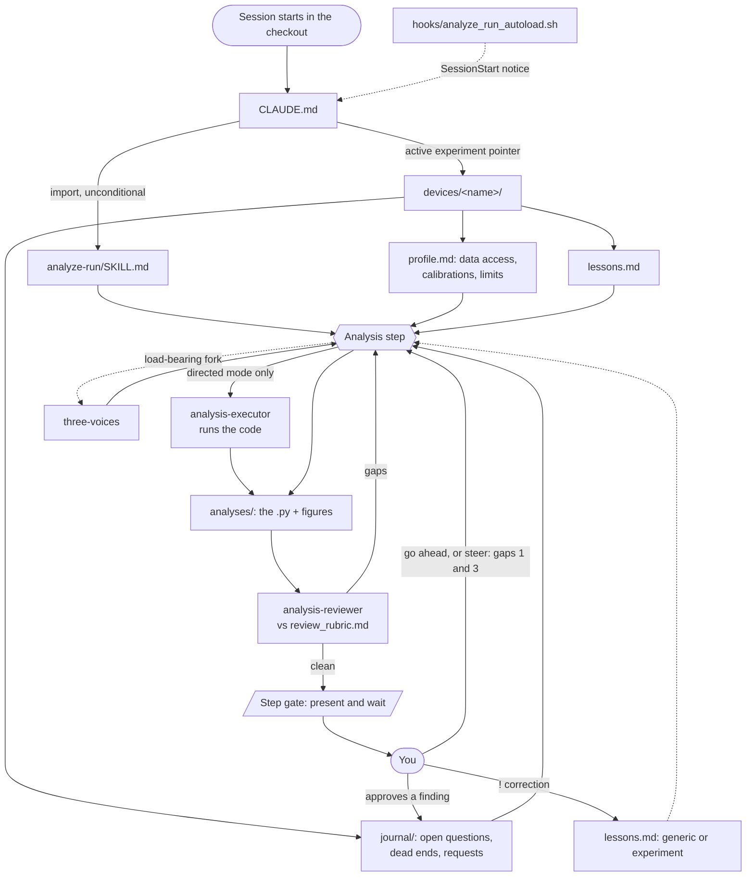

# AI-scientist-harness

A [Claude Code](https://claude.com/claude-code) harness for collaborative analysis of
experimental measurement data. It separates analysis craft (generic, in this repository) from
knowledge of your specific system (private, written by you).

The central idea is a **system profile**: a structured document you write once about your
experiment. The AI reads it at the start of every session to understand what you are measuring,
what can go wrong, and what you are trying to learn.

| | **Generic layer** | **Experiment layer** |
|---|---|---|
| Lives in | `.claude/`, `hooks/`, `CLAUDE.md`, `jupytext.toml` | `devices/<your-experiment>/` |
| Holds | analysis craft that applies to any measurement campaign | one setup, one campaign, your data |
| Contains instrument names, calibration numbers, results? | no (checked by grep) | yes, all of them |
| Changes when you move to a new experiment? | no | you write a new one |

Adopting the harness for a different system means writing one new directory under `devices/`.
The rest of the tree stays as it is.

### Read in this order

1. This file, for the map.
2. [`CLAUDE.md`](CLAUDE.md) at the root: the rules that bind every session, plus the pointer to
   the active experiment.
3. [`.claude/skills/analyze-run/SKILL.md`](.claude/skills/analyze-run/SKILL.md): the analysis
   workflow itself, which is where most of the behaviour lives.
4. [`devices/TEMPLATE/profile.md`](devices/TEMPLATE/profile.md): what you are expected to
   supply about your own system.

If you are an agent working in this checkout, items 2 and 3 are already in your context (see
[How the rules reach the model](#how-the-rules-reach-the-model)); start at item 4.

---

## What you bring

Before any analysis session, you write `profile.md` for your experimental system. This is what
lets the AI reason about your measurements rather than treating them as abstract numbers.

A complete profile covers five areas.

**The science.** What phenomenon are you studying? Name the effects you expect to see, the
parameter ranges where they should appear, and the competing explanations that would produce
similar signals. The AI cannot exclude a mundane explanation (thermalization, noise floor,
calibration drift) unless the alternatives are written down and the profile states what evidence
would rule them out.

**System vulnerabilities and weak spots.** Every measurement setup has failure modes that can
look like signal: drifting offsets, pickup at specific frequencies, an amplifier that clips at
high drive, a contact that degrades at low temperature. List yours. Without this list, the AI has
no basis for flagging a suspicious feature before you do.

**Hypotheses under test.** For each effect you are looking for, state what discriminating
evidence would confirm it, and what would rule it out. This gives analysis a concrete standard
for when a conclusion is defensible.

**The measurement setup.** Signal chain, instruments, gains, units, and calibrations. If a
conversion factor lives anywhere other than this document, it will drift or get lost.

**Data access.** How to load your data files: format, path conventions, the loader function. The
harness vendors your loader under `devices/<name>/lib/` so it stays alongside the profile.

---

## Repo map

```
CLAUDE.md                     # always-on rules + the "active device" pointer (SWAP POINT)
jupytext.toml                 # notebook pairing: .py is source of truth, .ipynb is the view

.claude/
  settings.json               # registers the hooks via $CLAUDE_PROJECT_DIR
  skills/
    analyze-run/
      SKILL.md                # the workhorse workflow: §0 setup ... §9 review ... §10 directed mode
      lessons.md              # generic operator-taught rules, grows via the !rule protocol
      review_rubric.md        # the bar the reviewer enforces (computation audit, verdict ladder)
    three-voices/
      SKILL.md                # isolated-context deliberation on one interpretive fork
  agents/
    analysis-reviewer.md      # independent critic; runs before anything reaches you
    analysis-executor.md      # directed-mode hands: computes, never interprets
    voice-skeptic.md          # the three deliberation voices, each with a distinct motive
    voice-pacifist.md
    voice-idealist.md

hooks/
  analyze_run_autoload.sh     # SessionStart: announce that the analyze-run rules are binding
  notebook_sync.sh            # Read/Edit: sync the .py in a worktree with the live .ipynb

devices/
  TEMPLATE/                   # generic skeleton for the next experiment
    profile.md                #   nine sections to fill in
    journal/SCHEMA.md         #   the journal format; seed the real files from this
  <your-experiment>/          # private, added by you: everything below is your content
    profile.md                #   single source of system truth
    lessons.md                #   experiment-taught rules + verbatim teaching archive
    lib/                      #   vendored data loader, standalone
    journal/                  #   the append-only scientific record (see below)
    analyses/                 #   deliverables, one dir per analysis: <topic>_<runids>/
```

Measurement data files stay outside version control (`*.db` is gitignored, and large raw files
should live beside the working copy rather than in it). `.ipynb` files are gitignored too,
because their `.py` twin is the committed artifact.

---

## How the pieces connect



The links in words:

- **`CLAUDE.md` is the only entry point.** It imports the `analyze-run` skill body inline and
  names the active experiment directory. Repointing that one line moves the whole harness to a
  different system.
- **The skill reads the profile, never the other way round.** `SKILL.md` says "follow the
  profile's data-access instructions"; `profile.md` says what those are. Neither file names
  anything from the other's layer, which is what keeps the generic half portable.
- **Every step passes the reviewer before you see it.** The reviewer gets the figure, the
  objective, and `review_rubric.md`, but never the analyst's narrative, so the audit is blind.
  Gaps come back in a fixed `GAP A1: ACCEPT / CONTEST` format.
- **The step gate is the heartbeat.** After the review and the fixes, the session stops and
  waits. The next step begins only on your reply, which may be a go-ahead or a steer ("gaps 1
  and 3", or an instruction that overrules the reviewer). Nothing queues in the background
  across a gate.
- **The journal is the memory between sessions.** Results attach to an open-question id; claims
  that will not firm up become `data_requests.md` entries; corrections that start with `!`
  become durable rules, routed to the generic or the experiment `lessons.md`.

---

## Module reference

### Rules layer

| File | What it is | When it is read |
|---|---|---|
| `CLAUDE.md` | Always-on non-negotiables (load the skill before touching data, stop at the step gate, review everything, never crop plotted data, ids on every figure, read your own PNGs) plus the active-experiment pointer and the `!rule` protocol | Loaded at startup, and after resume or compaction |
| `.claude/settings.json` | Hook registration, through `$CLAUDE_PROJECT_DIR` so the tracked copies are the ones that run, in the main checkout and in every worktree | Claude Code startup |

#### How the rules reach the model

`CLAUDE.md` begins with an import:

```markdown
@.claude/skills/analyze-run/SKILL.md
```

which expands the whole ~17 KB skill file into context before the first prompt,
unconditionally, and survives resume and compaction. The expansion is mechanical, so it does not
depend on the model choosing to open anything. A `SessionStart` hook cannot do this job: Claude
Code caps hook output at 10,000 characters and replaces anything longer with a short preview plus
a file path that sessions rarely open. The hook is therefore used only for the notice that the
rules are active.

### `analyze-run` (the workhorse skill)

`SKILL.md` is organised as a workflow, and its section numbers are worth knowing because the
rest of the repo cites them:

| § | Topic |
|---|---|
| 0 | Read the profile, experiment lessons, open questions, and the generic lessons first |
| 1–2 | Notebooks are opt-in; quick asks get a quick script. Notebook setup starts with an uncropped overview of all datasets, then a rubric drafted from what is actually in that figure |
| 3 | Epistemics: the hypothesis ledger, symmetric testing, the naming gate, the verdict ladder (established / supported / suggestive / unsupported) |
| 4 | Data-gap protocol: a missing discriminator becomes a measurement request rather than a hedged conclusion |
| 5 | Craft: one step per cell, append-only, fits overlaid with residuals and uncertainties, coverage tables, record what was excluded |
| 6 | Execution: cells are idempotent, the whole `.py` reruns top to bottom, then `jupytext --sync`, then the step gate |
| 7 | Background literature lane, with verified citations into the journal |
| 8 | Finish protocol: `memory.md`, an index line in `run_memory.md`, proposed journal edits |
| 9 | The review loop and, when a claim will not firm up, the pipeline audit |
| 10 | Directed mode, the two-model split |

Its companions: `lessons.md` holds generic rules taught by the operator (reading data, figures
and axes, fitting and calibration, extraction before trends, coverage and robustness), and
`review_rubric.md` defines the bar, including the computation audit, the verdict ladder, the
coverage table, the pipeline audit, and the rebuttal rules.

### Agents

Each agent file gives a **motive** rather than a tone, because behaviour follows from the motive
and survives paraphrase better than a style instruction does.

| Agent | Role | Invoked by |
|---|---|---|
| `analysis-reviewer` | Audits the step's code for formulas, normalizations, gains, masks, offsets, and units, then scores the figure against the rubric. Its premise: you can catch a wrong conclusion but not a wrong constant | `SKILL.md` §9, on every step |
| `analysis-executor` | Runs one concrete dispatch: load, compute, plot, print. It never chooses the next step and never writes physics narration. Its model is pinned in frontmatter | `SKILL.md` §10, directed mode |
| `voice-skeptic` | Hunts the unpriced cost behind a hopeful reading | `three-voices` |
| `voice-pacifist` | Demands triangulation by an independent probe, and a record of it | `three-voices` |
| `voice-idealist` | Lifts the frame and asks what the measurement is for | `three-voices` |

**Directed mode** (§10) splits a large analysis: the session model (director) owns all reasoning
and reads every figure itself, while a pinned-model executor runs the code. This lets you use a
stronger model for judgment while keeping compute costs predictable. The division is strict: the
ledger, the naming gate, the review loop, and the step gate all stay with the director, and if
the executor's report disagrees with what the figure shows, the figure wins.

### Hooks

`.claude/settings.json` registers them through `$CLAUDE_PROJECT_DIR`, so the copies tracked in
this repository are the ones that run, in the main checkout and in every worktree:

| Hook | Event | Effect |
|---|---|---|
| `analyze_run_autoload.sh` | `SessionStart` (startup, resume, clear, compact) | Walks up from the cwd to the nearest `analyze-run/SKILL.md` and emits a short notice that its rules bind this session. Emits nothing outside a harness checkout |
| `notebook_sync.sh` | `PreToolUse: Read` (pull), `PostToolUse: Edit\|Write` (push) | Mirrors a jupytext `.py` edited inside a worktree onto the live `.ipynb` in the project folder, and pulls the live version back before a read. Anything it would overwrite is copied to a timestamped backup directory first. Needs `jupytext` on `PATH` or at `$JUPYTEXT_BIN` |
| `db_guard.py` | `PreToolUse: Bash` | Refuses any shell command that would modify a raw-data file the device profile has declared protected. See below |

The hooks are deliberately small and always exit 0. `db_guard.py` is the only one that stops a
tool call, and it does so by returning a deny decision rather than by failing; a fault inside it
lets the command through. Registering them from inside the repository is also deliberate: a
settings path pointing at a copy elsewhere on the machine drifts, and edits to the tracked file
then have no effect on real sessions. Claude Code will ask you once to approve the project
settings.

#### Protecting the raw data files

Your raw measurement files are the scientific record, and no analysis has any reason to write to
one. An AI that can run shell commands can delete or overwrite a file as easily as it can read
it, and a single mistyped path in a refresh command destroys data no version control holds.
`db_guard.py` refuses that before the command runs: deletion, moving, truncation, redirection
into the file, in-place editing, write SQL, the Python equivalents through `os`, `shutil`,
`pathlib` and `open`, and a copy that would carry the file out of the checkout and over the
original. Reading stays untouched, and so does copying a master file over the local working
copy.

Which files are protected is declared in the device profile, not in the script:

```markdown
<!-- PROTECTED-FILES:BEGIN -->
mydevice_2026.db
<!-- PROTECTED-FILES:END -->
```

The hook reads that block from every `devices/*/profile.md`, so protecting a newly created file
is one line in the profile with no change to the script or the hook registration. A name is
matched as plain text anywhere in the command, which covers sidecars such as SQLite's `-wal` and
`-shm` for free. The `if` filter in `.claude/settings.json` spawns the script only for commands
mentioning a `.db`; widen that pattern if your data files have another extension. Two gaps are
known: a command that reaches a file through a glob such as `rm *.db` names nothing on the list,
and an empty block protects nothing, which the hook reports on stderr.

### Experiment layer

`profile.md` is the single source of system truth, in nine fixed sections: identity and goal,
data access and loading, units and normalization, signal chain, knobs and hard limits,
calibrations (dated, each with the procedure to re-measure it), established facts with
provenance, hypotheses under test with their discriminators, and a working-state pointer.

`journal/` is the append-only scientific record; `SCHEMA.md` in the same directory defines every
entry format.

| File | Holds |
|---|---|
| `open_questions.md` | The campaign's live questions, each with hypotheses, a discriminator, and a status |
| `dead_ends.md` | What was tried and why it failed, so nobody re-walks it |
| `data_requests.md` | Concrete sweeps that would discriminate, with status requested / taken / analyzed |
| `background_literature.md` | Dated literature findings with verified citations, cited by key from notebook cells |
| `run_memory.md` | One index line per completed analysis |

`lib/` holds your vendored data loader, kept standalone so the harness depends on no other
repository. `analyses/` holds the deliverables, one `<topic>_<runids>/` directory each,
containing the percent-format `.py`, its paired `.ipynb`, `figures/`, and `memory.md` (findings
in hypothesis-ledger terms, with what would change the conclusion).

---

## One analysis step, end to end

1. The session reads the profile, the experiment lessons, and the open questions (§0), then
   names the open-question id and the single discriminating cut before touching numbers (§5).
2. It loads data through the profile's sanctioned loader and plots everything uncropped (§2).
3. It reads the saved PNG itself. A figure is never narrated unseen.
4. The `analysis-reviewer` audits the step's code and scores the figure. Gaps come back
   numbered, and each one is either accepted or contested with a specific line, value, and
   reason.
5. Clear-cut defects are fixed before you see anything.
6. At the step gate the session presents the figure, what the step shows, and the remaining gaps
   as a numbered list, then waits. You may endorse all gaps, a subset, dismiss them, or overrule
   the reviewer.
7. Approved findings go to the journal by proposal. A correction beginning with `!` is
   generalized into one dated rule and appended to the generic or the experiment `lessons.md`.

When a claim will not firm up, §9's pipeline audit runs before anyone writes "not defensible":
reconstruct the chain from raw data to claim, judge the links, and re-test the data-scope
choices first, since those were made earliest and questioned least.

---

## Getting started

The harness carries no assumption about physics, instruments, or file formats. What it assumes
is that you have runs identified by an id, a loader that can fetch one, and questions you want
answered honestly.

1. Clone this repository, or add it as a `git remote` called `upstream` in a private copy and
   pull from there.
2. `cp -r devices/TEMPLATE devices/<your-experiment>` and fill in `profile.md`. See
   [What you bring](#what-you-bring) for the content; section 2 (data access and loading) is the
   one that unblocks everything else. List your raw-data filenames between the `PROTECTED-FILES`
   markers there, one per line, and `db_guard.py` will refuse any shell command that would
   modify them. Do the same when a new data file is created later.
3. Vendor your loader under `devices/<your-experiment>/lib/`. It should read completed runs and
   do nothing else: no instrument control, no dependency outside this repository.
4. Seed `journal/` from `journal/SCHEMA.md`: at minimum `open_questions.md`, plus empty
   `dead_ends.md`, `data_requests.md`, `background_literature.md`, and `run_memory.md`.
5. Create an empty `lessons.md` with a `LESSONS:END` marker. It fills itself as you correct the
   AI with `!` messages.
6. Repoint the "Active device" line in `CLAUDE.md`, marked in-file as the SWAP POINT.
7. Check that the Python environment named in `CLAUDE.md` (`## Environment`) matches yours: the
   scientific stack plus `jupytext`.
8. Open Claude Code in your working directory and describe what you want: "plot signal vs gate
   voltage for run 12", "fit the 200–250 K temperature sweep", "run three voices on open
   question 3", "!always subtract the baseline measured in run 3".

There is no install step for the rules or the hooks; both are wired up by files already in the
checkout. Wanting to change a generic-layer file to fit your system is usually a sign that the
content belongs in your `profile.md`.

### Where does X go?

| The thing you have | Where it belongs |
|---|---|
| A calibration constant, a gain, a wiring detail | `devices/<your-experiment>/profile.md` |
| "Never plot this quantity without that normalization" (true for this setup only) | `devices/<your-experiment>/lessons.md` |
| "Never crop a figure" (true for any measurement) | `.claude/skills/analyze-run/lessons.md` |
| A question the campaign is trying to settle | `journal/open_questions.md` |
| A sweep you wish existed | `journal/data_requests.md` |
| An approach that failed | `journal/dead_ends.md` |
| A paper that bears on an interpretation | `journal/background_literature.md` |
| Analysis code and figures | `devices/<your-experiment>/analyses/<topic>_<runids>/` |
| A change to how reviews are scored | `.claude/skills/analyze-run/review_rubric.md` |

---

## Conventions

- **Notebooks.** `jupytext.toml` pairs every notebook with a percent-format `.py`. The `.py` is
  the committed source of truth and the single write surface for the AI; the `.ipynb` is your
  live view and is gitignored. Cells are self-contained and idempotent, and the whole file must
  reproduce top to bottom after every step.
- **Figures.** Run ids and clear axis labels on every one. Nothing cropped, clipped, or masked
  unless you ask; a mask that defines a fit window is drawn on the figure, with the fit overlaid
  on unmasked data. Every saved PNG is read back before it is described.
- **Claims.** Each carries one rung of the verdict ladder plus the observation that would demote
  it. Only *established* and *supported* are presented as results.
- **Literature.** A background lane checks an interpretive claim against the literature before it
  is written up, and records the finding in `journal/background_literature.md` with verified
  citations.

---

## Public skeleton and private working copy

This repository is the public skeleton. To use it, clone it privately and add your experiment
directory. The two copies differ by exactly two things: the files present (your working copy
adds `devices/<name>/`) and one pointer line in `CLAUDE.md`, marked in-file as the SWAP POINT.

| | Public skeleton | Private working copy |
|---|---|---|
| Visibility | public | private |
| Active experiment | `devices/TEMPLATE/` | `devices/<your-experiment>/` |
| Contains real data or results | no | yes |

The craft files (`.claude/skills/`, `.claude/agents/`, `hooks/`, `devices/TEMPLATE/`) carry
analysis discipline with no experiment-specific content. Before publishing any change to the
public skeleton, verify this with grep:

```sh
# Run from the repo root. Must print nothing.
grep -RInE '<your-experiment-tokens>' .claude/ devices/TEMPLATE hooks/
```

A hit means content landed in the wrong layer, and the fix is to move it into your `profile.md`
or `journal/`. The `!rule` protocol routes new rules generic-versus-experiment for the same
reason.
